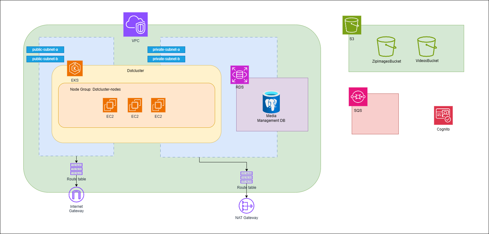

# Infraestrutura
Repositório de infraestrutura como código contendo os scripts Terraform para provisionamento da estrutura EKS na AWS. A aplicação dessa infraestrutura está configurada para ser executada através do [Github Actions](https://docs.github.com/pt/actions/about-github-actions/understanding-github-actions).

# Infraestrutura gerenciada:
- **VPC:**
    - Subnets públicas
    - Subnets privadas
    - Route Tables
    - Internet Gateway
    - NAT Gateway
    - Security Groups
- **EKS:**
    - Cluster Kubernetes
    - Node Groups
- **Banco de Dados:**
    - RDS PostgreSQL
    - Subnet Group para RDS
- **Armazenamento:**
    - S3 Buckets para armazenamento de vídeos e arquivos compactados
- **Cognito**
    - Pool de usuários para enviar vídeos e baixar as imagens
- **SQS**
    - Fila de mensagens para processamento dos vídeos 



## Como rodar esse projeto localmente
Necessário que possua as seguintes ferramentas instaladas:
 - [AWS CLI](https://docs.aws.amazon.com/cli/latest/userguide/getting-started-install.html)
 - [Kubectl](https://kubernetes.io/pt-br/docs/tasks/tools/)
 - [Terraform](https://developer.hashicorp.com/terraform/install?product_intent=terraform)

### Agora devemos seguir o passo-a-passo:
1. Adicionar as credenciais da AWS localmente. Consulte [este tutorial](https://docs.aws.amazon.com/cli/v1/userguide/cli-chap-configure.html) para mais informações.
2. Dentro do projeto, rodar o comando `terraform init`.
3. Rodar o comando `terraform plan` para executar as verificações.
4. Rodar o comando `terraform apply` para aplicar as alterações.
5. Atualizar o kubeconfig para conectar no cluster recém-criado:
   ```sh
   aws eks update-kubeconfig --region us-east-1 --name dotcluster
   ```

