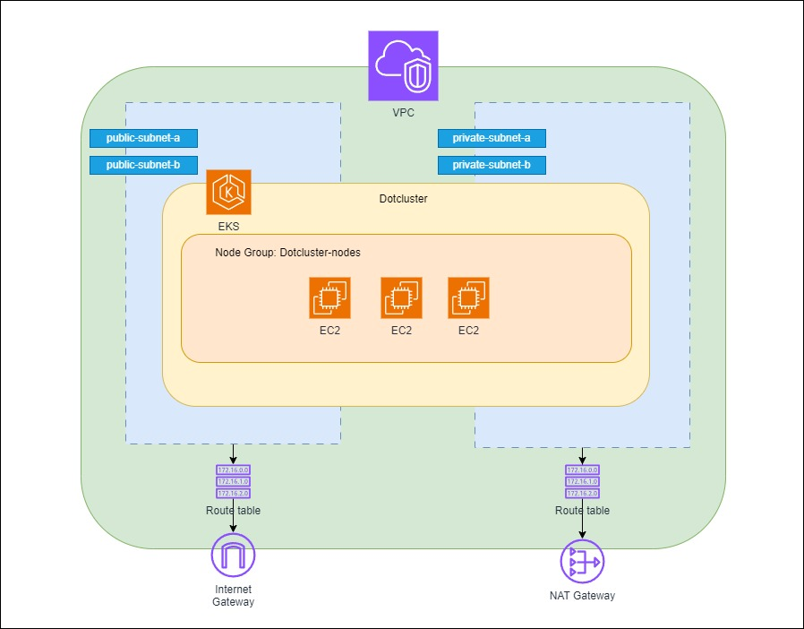

# Kubernetes Terraform
Repositório de infraestrutura como código contendo os scripts Terraform para provisionamento da estrutura EKS na AWS. A aplicação dessa infraestrutura está configurada para ser executada através do [Github Actions](https://docs.github.com/pt/actions/about-github-actions/understanding-github-actions).

# Infraestrutura gerenciada:
- VPC:
    - Subnets públicas
    - Subnets Privadas
    - Route Tables
    - Internet Gateway
    - NAT Gateway
    - Security Groups
- EKS:
    - Node Groups

## Como rodar esse projeto localmente
Necessario que possui as seguintes ferramentas instaladas
 - [AWS CLI](https://docs.aws.amazon.com/cli/latest/userguide/getting-started-install.html)
 - [Kubectl](https://kubernetes.io/pt-br/docs/tasks/tools/)
 - [Terraform](https://developer.hashicorp.com/terraform/install?product_intent=terraform)

### Agora devemos seguir o passo-a-passo
1. Adicionar as credenciais da aws localmente, consulte [este tutorial](https://docs.aws.amazon.com/cli/v1/userguide/cli-chap-configure.html) para mais informações.
2. Dentro do projeto rodar o comando `terraform init`
3. Rodar o comando `terraform plan` para executar as verificações
4. Rodar o comando `terraform apply` para aplicar as alterações
5. Atualizar kubeconfig para conectar no cluster recém criado `aws eks update-kubeconfig --region us-east-1 --name dotcluster`
